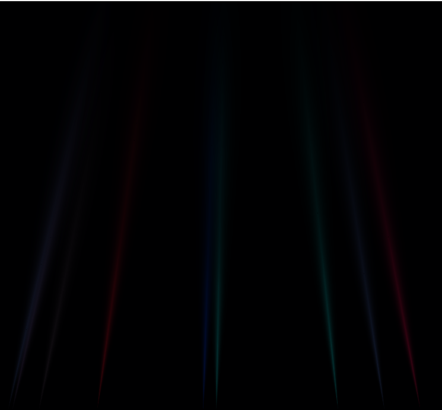

# Разработка алгоритма отрисовки световых столбов в реальном времени на основе соответствующих физических процессов

Данная работа выполнена с целью физически достоверного воспроизведения такого атмосферного оптического явления, как световые столбы. Результаты представлены в качестве ВКР по направлению "Технологии разработки компьютерных игр" Университета ИТМО (Санкт-Петербург) в 2024 году.

## Запуск проекта

Для запуска проекта потребуется среда с поддержкой C++ и DirectX 11. Рекомендуется установить Microsoft Visuial Studio 2022, при этом следует добавить пакет "Разработка на языке C++". Все остальные ресурсы (модели, текстуры, шейдеры) загрузятся вместе с проектом.

Далее, после запуска Visual Studio необходимо выбрать опцию "Открыть проект или решение" и выбрать директорию, куда были загружены репозитория.

После того, как проект загрузился, его можно будет запустить через соответствующую кнопку в верхней панели.

## Обзор решения

Цель демонстрации: наглядно показать взаимодействие моделируемого светового столба с окружением.

1. Структура столба зависит от позиции наблюдателя. В расчет включены атмосферное поглощение, потери при отражении, ширина столба, теоретическое размещение кристаллов льда

  

2. Учитывается глубина размещения столба на сцене

3. На структуру столба влияют объекты, находящиеся в объеме формирования явления

4. Поддерживается отрисовка множества столбов

